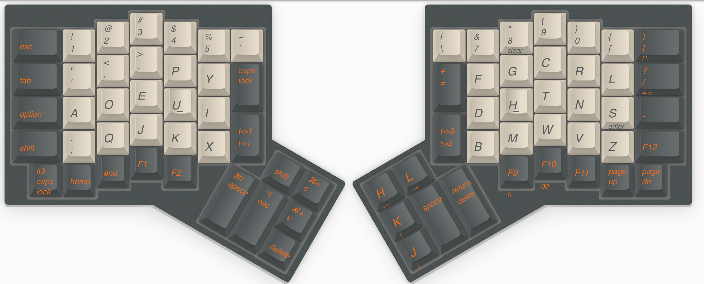

# My keymap of ergodone
## ergodone_v1

- Layer 1: QWERTY layout

- Layer 2: dvorak layout + layer 3 modifier and vim hjkl on right thumb cluster

- Layer 3: Left hand: Fn numpad, Right hand: Numpad, Right thumb cluster: arrows
