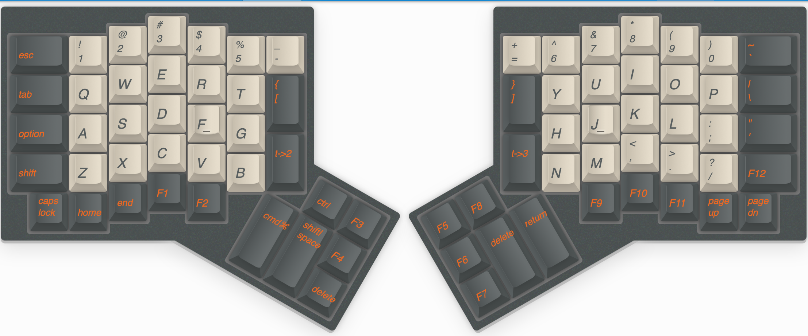
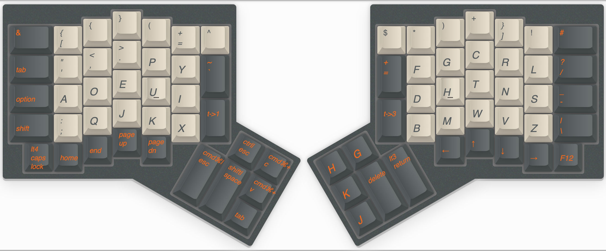
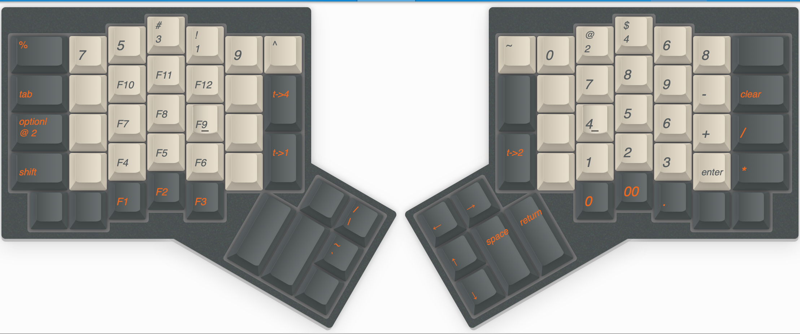
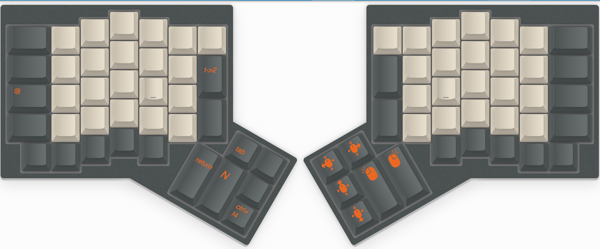

# My keymap of ergodone

## ergodone_v5

- Layer 1: QWERTY layout. For emergency.
  
- Layer 2: Main layout layer: dvorak layout + layer 3/4 modifier and vim hjkl
  on right thumb cluster, arrow keys on right bottom rows
  
- Layer 3: Left hand: Fn numpad, Right hand: Numpad, Right thumb cluster: arrows
  
- Layer 4: Left thumb cluster: shortcuts for Material Studios operations in
  Windows. Right thumb cluster: mouse movements and left/right clicks.
  
